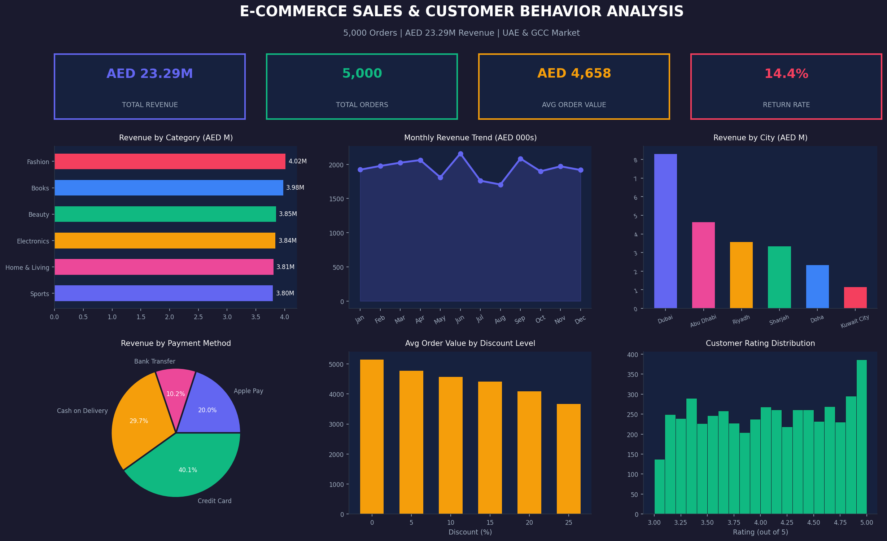

# E-Commerce Sales & Customer Behavior Analysis

**Tools:** Python · Pandas · NumPy · Matplotlib

## Overview
Analyzed 5,000 e-commerce orders across UAE and GCC region
to identify revenue trends, top categories, customer behavior,
and payment patterns. Covers Dubai, Abu Dhabi, Riyadh, and Doha.

## Key Results
- Total Revenue: **AED 23.2 Million** across 5,000 orders
- Average Order Value: **AED 4,658**
- Return Rate: **14.4%** — identified improvement opportunities
- Average Customer Rating: **4.01 / 5.0**

## Dashboard Preview

## Analysis Includes
- Revenue by product category
- Monthly revenue trend
- Revenue by city (UAE & GCC)
- Payment method distribution
- Discount impact on order value
- Customer rating distribution

## Files
- `ecommerce_analysis.py` — Full Python analysis script
- `ecommerce_data.csv` — Orders dataset (5,000 records)

## How to Run
1. Download `ecommerce_analysis.py`
2. Run: `python ecommerce_analysis.py`
